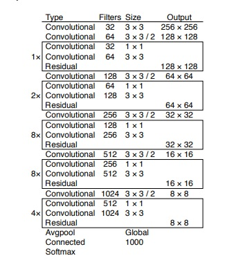
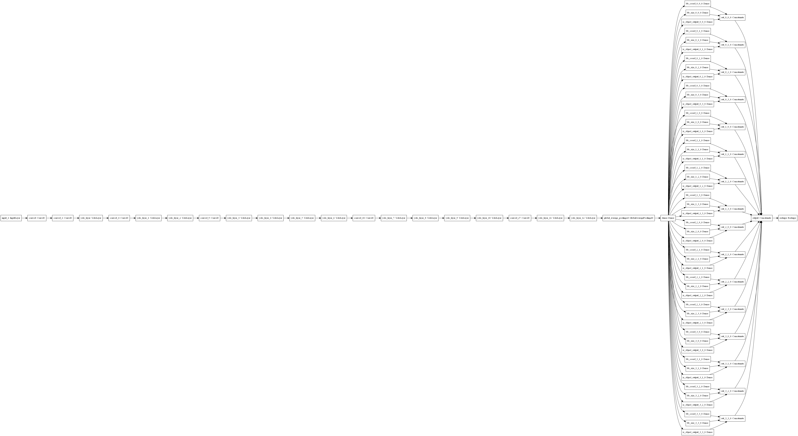
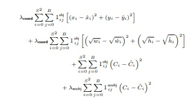

# Object Detection
Authors: Bc. Martin Hurňák, Bc. Kamil Mucha

## Motivation
Object detection is a main challenge of computer vision field. Thanks to the recent advancement in deep learning, we are able to train object detection applications, but they still require large datasets to achieve high levels of accuracy.

Object detection includes detection of individual objects on image, labeling them with correct class and creating a bounding box around them. Bounding box includes coordinates of the center of the object and height and width. We could also choose a different, more difficult approach to this, and go with segmentation. With segmentation we need to define exactly which pixels belong to the specific object. Since we are able to process images this way, we can also apply object detection on videos. With enough computing power and optimal algorithm we can even make it work in real time.

Object detection can be applied in many different fields. For example, tracking specific objects in the environment, video surveillance, pedestrian detection, anomaly detection, counting people and their movement and face detection.

## Related Work
If we aim to detect only one object, it can be formed as regression problem - our goal is to find foursome `(x, y, w, h)`, where `(x, y)` is position of bounding box, `w` is width and `h` is height of bounding box and label it with appropriate class. However, there can be more occurrences of object of interest in a picture, so we cannot solve this as simple classification + regression problem as the length of output is variable. We need to find different regions of interest in an image and use CNN to classify this regions.

#### R-CNN
One of possible approaches for this task is called _Regions with CNN features_ or R-CNN. Selective search is used to extract 2000 region proposals from given image. Regions are then processed by CNN which extracts feature vector. SVM classifies presence of object in a region based on extracted features and bounding-box regressors predict offsets [1]. This approach is considered very slow as the CNN needs to process 2000 regions per image. In training phase, we also need to train its parts separately.

#### SPP-net
In _Spatial Pyramid Pooling network_ (SPP-net) image is fed into CNN that extracts feature maps only once. Region proposals are applied to feature maps. Feature maps are then processed by SPP-layer, which allows network to process images of arbitrary sizes. However, classification and regression is performed similarly to R-CNN, so architecture needs to be trained at multiple stages [2].

#### Fast R-CNN
_Fast R-CNN_ method solves this problem by using single network architecture. It uses only single level SPP-layer called RoI pooling layer which makes whole network trainable during single stage. It also introduces softmax layer for classification instead of SVM [3].

#### Faster R-CNN
_Faster R-CNN_ further improves object detection process by replacing selective search with _Region Proposal Network_ (RPN) that proposes regions from feature map. It serves as an 'attention' of network. Regions are then RoI pooled and classified as in Fast R-CNN. RPN can share convolutional layers with detection network (e.g. Fast R-CNN) [4]. This model is much faster than original R-CNN, although it is still not enough fast if we want to detect objects in real-time (e.g. in a video)

#### YOLO
_You Only Look Once_ (YOLO) is extremely fast approach for object detection. Detection is reframed as a single regression problem where bounding box coordinates and class probabilities are predicted straight from image pixels. Image is divided into _S x S_ grid, where each grid cell predicts _B_ bounding boxes and their confidence scores. Grid cell is responsible for detecting an object if its center falls into that grid cell. Non-max supression is then used to discard duplicate detections. YOLO  reasons globally about the image and is much better at generalizing in comparison to R-CNN methods [5]. However, detecting each of multiple smaller objects in a group (e.g. flock of birds or crowd of people in a distance) is a problem for YOLO as we can get only limited number of bounding box predictions per grid cell.

## Datasets
#### COCO, Common Objects in Context
This dataset offers images for object detection/segmentation training, validation and testing. For training there is 118K images available with captions of what is happening on the image and detection, classification and segmentation of the object on the image. For Validation there is 5K images available and 41K for testing. For classification there is 80 different classes ranging from toothbrushes, apples and oranges up to trains and boats. 
http://cocodataset.org/#home

#### VOC2012, Visual Object Classes Challenge 2012
This dataset offers 17125 images, from which all of them have annotations that describe what objects are on the picture and exact xmin, xmax, ymin, ymax coordinates where they begin and end. For classification there is 20 classes which focus on animals, vehicles, indoor objects and people. 
http://host.robots.ox.ac.uk/pascal/VOC/voc2012/index.html

## Model
We have experimented with approach similar to YOLO algorithm, and we have focused on detecting only one specific class of objects. Similar to YOLO algorithm, we have divided images into S x S grid and predicted one bounding box for each grid cell. For feature extraction we have used architecture from YOLOv3 paper [6], but we have experimented with different layer sizes and convolutional-convolutional-residual layers count. As activation we have used Leaky ReLU (same as in paper).

#### Outputs
Output of our model consists of outputs for each grid cell. One bounding box is defined by tuple `(x, y, w, h, c)` where
`(x, y)` is position offset from top left corner of bounding box relative to grid cell, `(w, h)` is size of bounding box relative to whole image and `c` is confidence of prediction. This method was inspired by original YOLO paper [5]. All of the values mentioned are from <0,1> interval, so our output layer consists of `S x S x 5` neurons with sigmoid activation function. We have trained our network for detecting only one specific class (e.g. people). Our model then looks like this:

#### Loss function
As loss function, we use sum squared error proposed by [5], where we omit box classification part. Our modified loss function 
then looks like this:

Ones with obj/noobj mean that part is only calculated for part that do (1obj) or do not (1noobj) contain objects. Lambdas 
in loss function are constant coeficients to prevent gradient from cells that do not contain object overpower
gradient from cells that do. Original paper uses &lambda;noobj = 0.5 and &lambda;coef = 5. Probably,
we will experiment with &lambda;noobj as it seems to be important hyperparameter for precision-recall ratio.

## Training <!--Description of the training routine.-->
For training of our model, we have decided to focus on detecting people, as this class is most common object in our explored image datasets. For training we have also used the opportunity to work with google cloud compute engine. We split data on train, validation and test (81:9:10). During training we monitor loss and metrics on validation data and use testing data only to evaluate models with best validation metrics.

#### Used dataset and preprocessing
We have decided to use VOC2012 dataset, which has 9583 images containing at least one person. This dataset also required slight preprocessing changes to the way bounding box are described. As described in outputs of our model, our model represents bounding boxes by center offset from the top left corner of grid box and by width/height of bounding box, where this dataset had exact xmin, xmax, ymin, ymax coordinates where the bounding box begins and ends.

#### Model configuration
We have setup a config.yaml file for configuration of our model. Here we can easily adjust batch size, amount of epochs, image input size, convolution layers size, dense layer size, number of "YOLO" layers (1x1 convolution, 3x3 convolution, residual connection), enable/disable batch normalization, change used optimizer (from SGD and Adam options), set initial learning rate, enable/disable learning rate scheduling, adjust loss coefficient of negative box, position and size and adjust regularization.

## Experiments <!--Description of the experiments you conducted.-->

### Hyperparameters
In our experiments, we have optimized following hyperparameters:
  - Learning rate - this was probably the most important hyperparameter. Although we used Adam optimizer most of the time, initial learning rate is important as we found that bigger model is highly unstable in first few epochs, resulting in NaN loss if the learning rate is too high. Learning rate needs to be low at the beginning, while we can increase it later during training. For this we used learning rate scheduler. If scheduler is enabled we double the learning rate at the end of 5th, 10th and 15th epochs. If training takes longer than 30 epochs, we reduce learning rate by half at the end of 30th, 35th and 40th epochs as well.
  - Negative box loss coeficient (&lambda;noobj) - as described in Loss part, this coeficient reduces penalization of model for predicting boxes, where they should not be, to prevent situation where model does not predict any boxes, as the gradients from cells that do not contain object can easily overpower gradient from cells that do contain an object. We have tried &lambda;noobj from interval <0.03, 0.5>. Best precision-recall ratios are achieved with &lambda;noobj somewhere around 0.05
  - Convolutional layer sizes - we manually adjusted size of first convolutional layer only, sizes of other layers are adjusted automatically according to first layer to preserve ratios from original YOLO v3 extractor. We started with 4 filters at first layer and slowly increased it up to 32 filters at first layer (which results in 1024 filters in last convolutional layer).
  - Number of "YOLO layers" (one 1x1 convolution, 3x3 convolution, residual connection block). Original YOLO v3 feature extractor uses five layers consisting of [1, 2, 8, 8, 4] block respectively we started at [1, 2, 2, 2, 2] and increased counts later on. At [1, 2, 8, 8, 4] model was highly unstable during first epochs, which we could not solve even by decreasing learning rate. Best results were achieved using [1, 2, 4, 4, 4] model.
  - Dense layer size - size of one fully connected layer between extractor and output. We tried sizes of 512 and 1024. We have better results with 512.
 - Batch normalization - we tried batch normalization as well, although we stopped using it as it caused model to overfit training data heavily while not decreasing validation loss at all.
 - Regularization - to prevent overfitting we used mainly L2 regularization of weights and biases (although we tried L1L2 regularization as well). L2 regularization in our experiments is usually set between <0.0001, 0.0003> with best results at 0.0002.

#### Logging
We were logging all input hyperparameters from config file and for validation metrics we were logging loss, precision and recall. All logs were saved in JSON format in log.json file with first pair of information being the `log name : timestamp`. As addition to this, we have aswell used the tensorboard logging function and we have kept the logs under the same name as in log.json.

You can see table of logs here: https://github.com/MartinHurnak/NN_project/blob/master/notebooks/Yolo_test.ipynb

### Evaluation
For evaluation of our experiments we have implemented our own precision and recall metrics with following adjustments:
 - Positive - if prediction has confidence score over 0.5, it is considered positive.
 - True Positive - as true positive, we consider predictions, that have confidence score >0.5 and IOU with any ground truth box >0.5 as well
 - False Negative - we treat ground truth boxes, that do not have any True Positive matched with them (IOU <0.5 with all positive predictions) as false negatives

With these assumptions, we could implement precision and recall with their regular formulas:  
Precision = True Positives / Positives  
Recall = True Positives / (True Positives + False Negatives)

Then we can calculate F1 score as well:  
F1 = 2 * Precision * Recall / (Precision + Recall)

## Results, pros and cons of our model <!--The results of these experiments and their analysis.-->
Our best model, according to F1 score at validation data, has 52.2% precision and 48.1% recall at testing data, which results in 50.1% F1-score at testing data.

Another model, we consider performing very good achieves 48.1% precision and 48.3 recall at testing data. but we found out, it performs good even on objects that do not have labels in data.

## Future Work
Obvious continuation of this work can be predicting bounding boxes for multiple classes. We can increase number of predicted bounding boxes per grid cell to make detection of individual objects in large group better.

We tuned &lambda;noobj coeficient in our experiments, although we only used single constant for whole grid. Another possible expansion is using separate &lambda;noobj for each cell to balance various frequency of positions of bounding boxes in individual cells.

Data augmentation can further help increase performance of our model, as we experienced problem with predicting boxes for blurred or grayscale images (however, they are not that frequent in our dataset).

## References
[1] Girshick, R., Donahue, J., Darrell, T. and Malik, J., 2014. Rich feature hierarchies for accurate object detection and semantic segmentation. In Proceedings of the IEEE conference on computer vision and pattern recognition (pp. 580-587).

[2] He, K., Zhang, X., Ren, S. and Sun, J., 2015. Spatial pyramid pooling in deep convolutional networks for visual recognition. IEEE transactions on pattern analysis and machine intelligence, 37(9), pp.1904-1916.

[3] Girshick, R., 2015. Fast r-cnn. In Proceedings of the IEEE international conference on computer vision (pp. 1440-1448).

[4] Ren, S., He, K., Girshick, R. and Sun, J., 2015. Faster r-cnn: Towards real-time object detection with region proposal networks. In Advances in neural information processing systems (pp. 91-99).

[5] Redmon, J., Divvala, S., Girshick, R. and Farhadi, A., 2016. You only look once: Unified, real-time object detection. In Proceedings of the IEEE conference on computer vision and pattern recognition (pp. 779-788).

[6] Redmon, J. and Farhadi, A., 2018. Yolov3: An incremental improvement. arXiv preprint arXiv:1804.02767.
